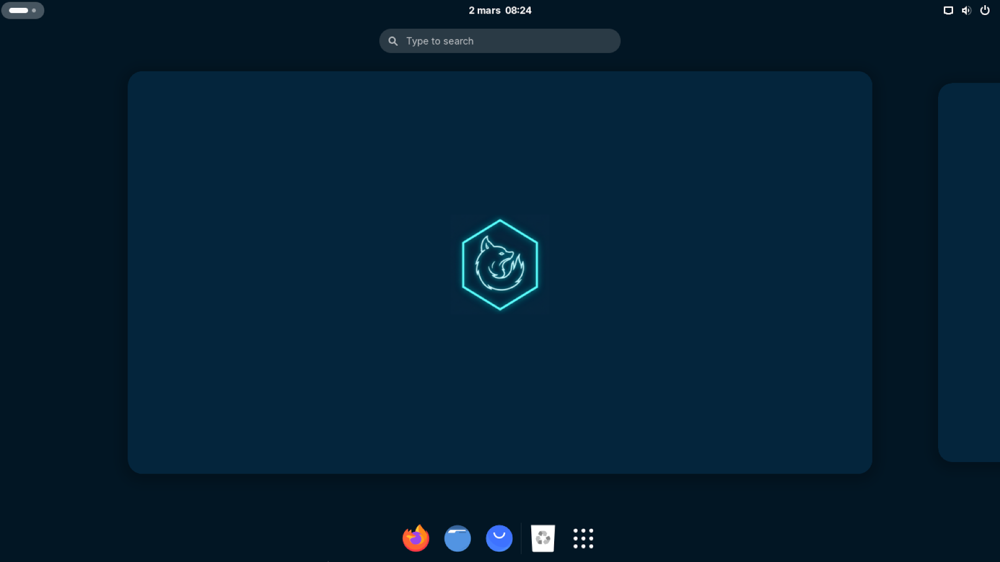
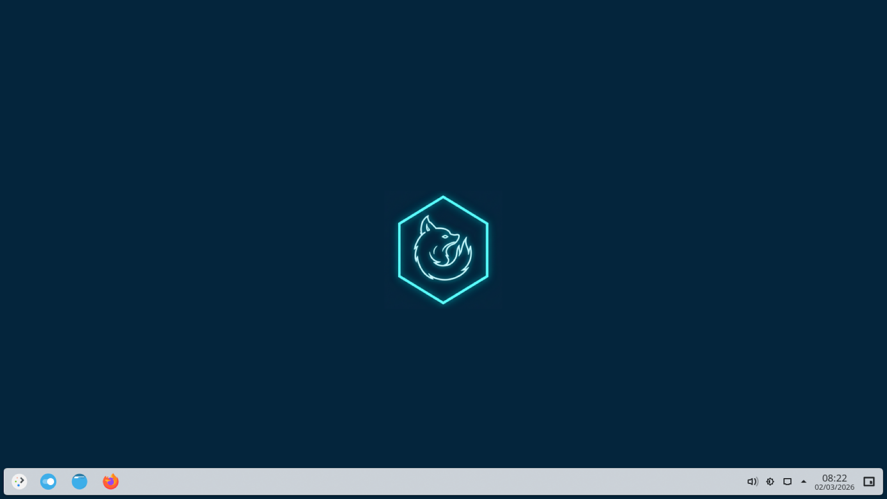
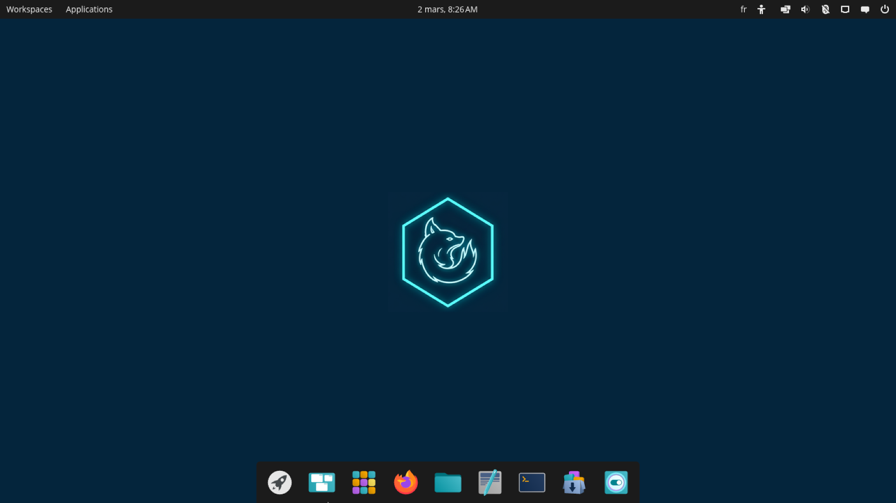
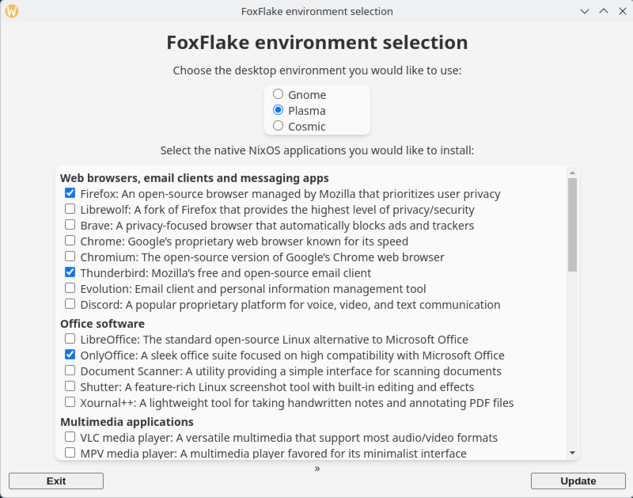

<div id="top"></div>

<!-- Shields/Logos -->
[![License][license-shield]][license-url]
[![Issues][issues-shield]][issues-url]
[![Discord][discord-shield]][discord-url]

# FoxFlake

FoxFlake is a comprehensive configuration of the NixOS Linux distribution (Flake) that automates NixOS management tasks to keep the user experience simple.<br><br>

## Key features

🖥️ Environment flexibility<br>
  - Desktop versatility: Seamlessly switch between GNOME, KDE Plasma, and COSMIC desktop environments.<br>
  - Simple package management: Manage your set of NixOS applications via the "FoxFlake Environment Selection" tool and use the desktop environment’s store to install Flatpaks.<br>
  - Extended binary cache: FoxFlake ensures with its own binary cache that prebuilt packages are available for all included desktop environments and packages configurations (it avoids NixOS from building packages from source when a binary package is not available).<br><br>

🛡️ Automation & Reliability <br>
  - Automated lifecycle: The system automatically transitions between NixOS versions, providing a "rolling release" experience without manual configuration changes.<br>
  - Zero-intervention maintenance: FoxFlake automates daily updates for both system packages and system / user Flatpaks (System updates are staged in the background and applied safely on the next boot).<br>
  - Atomic rollbacks: Leveraging the Nix "Generations" mechanism, FoxFlake allows you to instantly revert to previous working states directly from the boot menu.<br><br>

🚀 Declarative Foundation<br>
  - Base layer management: Focus on your specific configurations while FoxFlake maintains the core configurations.<br>
  - Unrestricted options: All NixOS options remain available and supersede FoxFlake defaults.<br>
  - Unified declarative stack: Includes home-manager, plasma-manager, and nix-flatpak for complete system-to-users configuration.<br><br>

## Installation & Usage

1. Download the latest ISO from the Releases page.<br>
2. Use balenaEtcher, GNOME Disks or KDE ISO Image Writer to create a bootable USB drive (do not use Rufus, it is not compatible at the moment).<br>
3. Ensure that Secure Boot is disabled in your BIOS, boot from the USB and follow the graphical installer (during installation, you will be prompted to select your preferred Desktop Environment and to choose your NixOS native applications).<br><br>

<div align="center">
Gnome:<br><br><br>
Plasma:<br><br><br>
Cosmic:<br><br><br>
FoxFlake environment selection:<br><br><br>
</div>

FoxFlake is designed to accommodate two distinct types of users:<br>
  - Zero-Maintenance Mode: Manage your NixOS apps via the "FoxFlake Environment Selection" application, install flatpaks from the desktop environment's store and let FoxFlake handle the maintenance.<br>
  - Custom Declarative Configurations: Define your custom configurations in the file /etc/nixos/configuration.nix, the core OS maintenance is taken care of and you are only in charge of maintaining your specific configurations.<br><br>

## Complementary instructions:

### Changing desktop environment or native applications after installation

The "FoxFlake Environment Selection" application allows you to review at any point in time the desktop environment and applications choices you made.<br><br>

### Adding custom configurations

FoxFlake allows you to add any NixOS / Home Manager / Plasma Manager configurations.<br>
Add your configurations to the file /etc/nixos/configuration.nix and update FoxFlake by running `foxflake-update`. Once done, reboot your system for changes to take effect.<br><br>

Examples of configurations include:
- Install specified system packages (use "pkgs.unstable" instead of "pkgs" for nix unstable channel packages):<br>
`foxflake.system.packages = with pkgs; [ vim ];`<br>
- Installs specified system Flatpaks:<br>
`foxflake.system.flatpaks = [ "org.mozilla.firefox" ];`<br>
- Install specified packages for a specific user (use "pkgs.unstable" instead of "pkgs" for nix unstable channel packages):<br>
`foxflake.users.<username>.packages = with pkgs; [ vim ];`<br>
- Install specified Flatpaks for a specific user:<br>
`foxflake.users.<username>.flatpaks = [ "org.mozilla.firefox" ];`<br>
- Add the user to the group wheel:<br>
`foxflake.users.<username>.extraGroups = [ "wheel" ];`<br>
- Modify your hostname:<br>
`foxflake.networking.hostname = "foxflake";`
- Change the default Display Manager / Desktop Environment wallpaper:<br>
`foxflake.customization.environment.wallpaper = "/home/common/wallpaper.png";`<br>
- Disable automatic updates (then update your system manually by running `foxflake-update`):<br>
`foxflake.autoUpgrade = false;`<br>
- If you installed the Sunshine application, you can add this line for Sunshine to start automatically:<br>
`services.sunshine.autoStart = true;`<br>
- If you installed the OpenRGB application, you can add this line to load the profile "myprofile" on startup:<br>
`services.hardware.openrgb.startupProfile = "myprofile";`<br>
- Enable an scx scheduler:<br>
```
services.scx = {
enable = true;
scheduler = "scx_lavd";
};
```

### Installing the nvidia driver

For Nvidia GPUs compatible with the latest open source kernel modules, recommended drivers are automatically enabled during install.<br>
For older nvidia cards, you will need to follow the [NixOS nvidia instructions][NixOS-nvidia].<br><br>

### Setting up the Home manager user environment

Home manager is installed by default, to initialize home manager for your user you need to run the command: `nix run home-manager -- init --switch`.<br>
You can then apply your user home manager configuration updates with the command: `nix run home-manager switch`.<br><br>

### Building the FoxFlake installer iso image

1. Install the nix package manager on your system according to the instructions at: https://nixos.org/download.<br>

2. Clone this repository:<br>
`git clone -b stable https://github.com/sebanc/foxflake.git`<br>

3. Enter the "installer" subfolder:<br>
`cd ./foxflake/installer`<br>

4. Update the installer flake lock:<br>
`nix --extra-experimental-features "nix-command flakes" flake update --flake .`<br>

5. Launch the build:<br>
`nix --extra-experimental-features "nix-command flakes" build .#installer`<br>

The generated installer iso image will be located in the "result/iso" folder.<br><br>

## Thanks goes to:
- [NixOS][NixOS] and community modules (home-manager, plasma-manager and nix-flatpak) maintainers.<br>
- [Cachix][Cachix] for their open source projects free binary cache plan.<br>
- The Gaming Linux France community for the inspiration coming from their [gaming oriented GLF OS][GLF-OS].<br><br>


<!-- Reference Links -->
<!-- Badges -->
[license-shield]: https://img.shields.io/github/license/sebanc/foxflake?label=License&logo=Github&style=flat-square
[license-url]: ./LICENSE
[issues-shield]: https://img.shields.io/github/issues/sebanc/foxflake?label=Issues&logo=Github&style=flat-square
[issues-url]: https://github.com/sebanc/foxflake/issues
[discord-shield]: https://img.shields.io/badge/Discord-Join-7289da?style=flat-square&logo=discord&logoColor=%23FFFFFF
[discord-url]: https://discord.gg/x2EgK2M

<!-- Internal Links -->

<!-- Outbound Links -->
[NixOS]: https://nixos.org
[Cachix]: https://www.cachix.org
[NixOS-nvidia]: https://nixos.wiki/wiki/Nvidia
[GLF-OS]: https://www.gaminglinux.fr/glf-os


