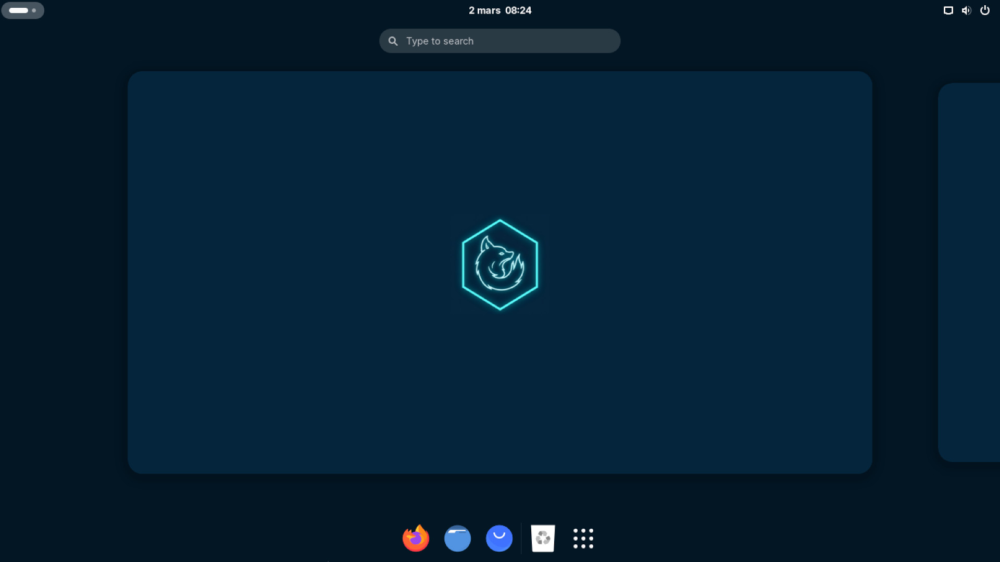
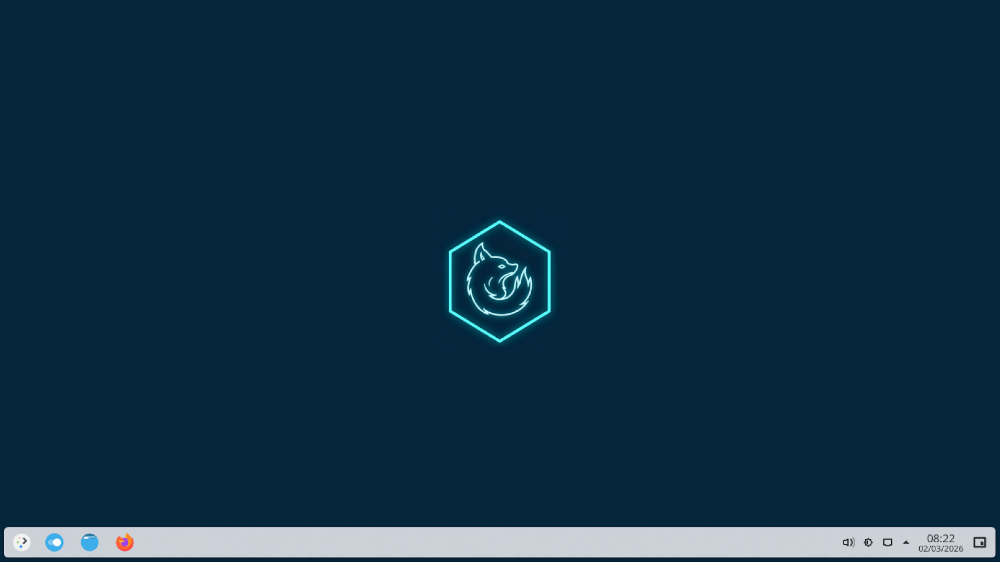
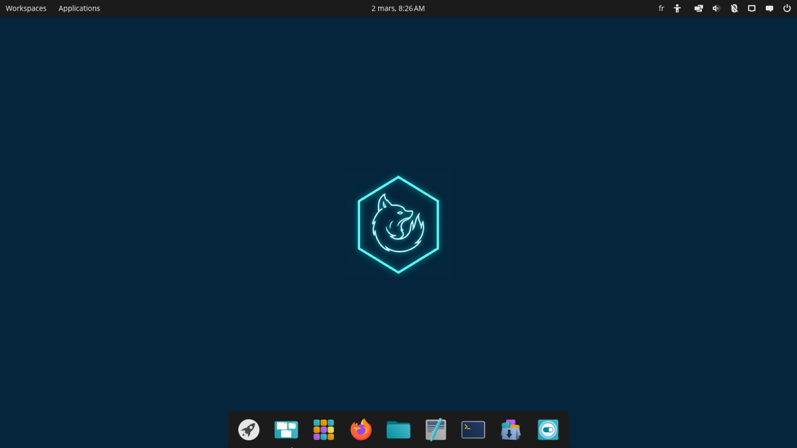
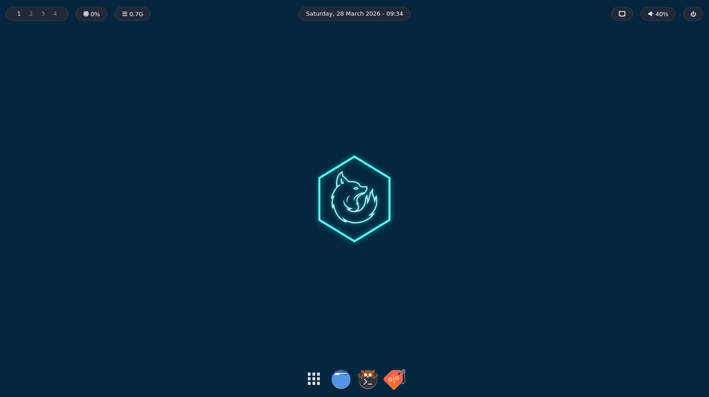
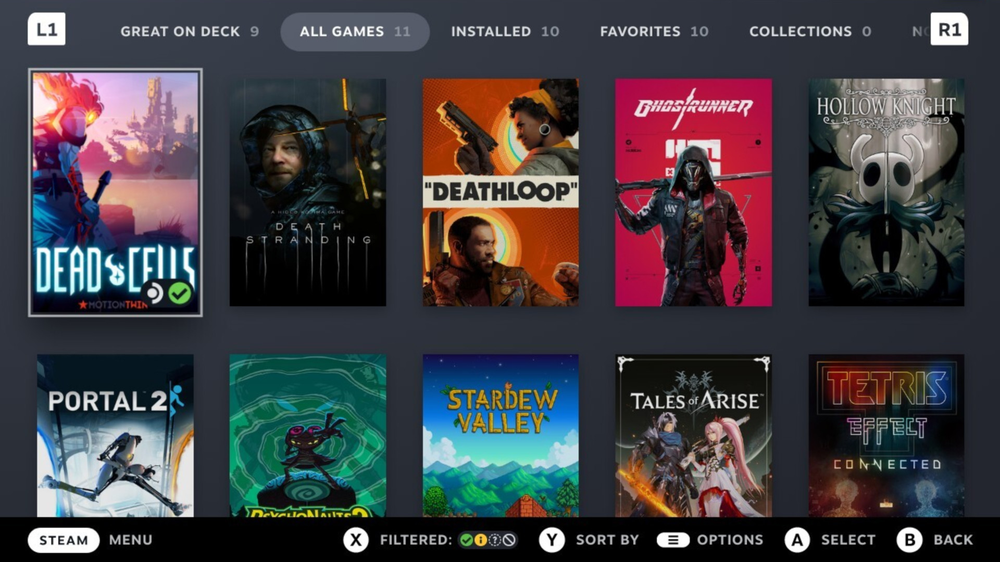
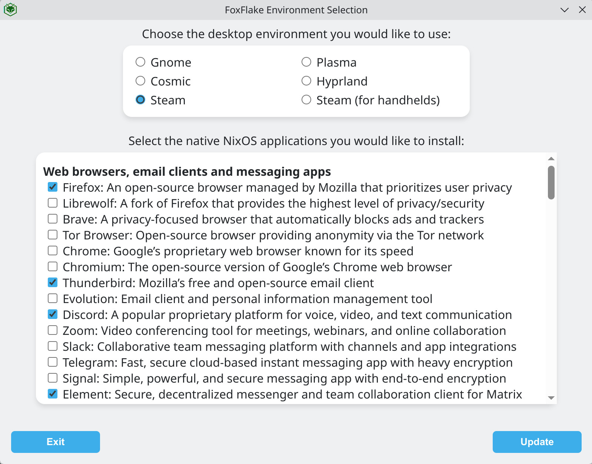

<div id="top"></div>

<!-- Shields/Logos -->
[![License][license-shield]][license-url]
[![Issues][issues-shield]][issues-url]
[![Discord][discord-shield]][discord-url]

<h1 align="center">FoxFlake</h1>

FoxFlake is a comprehensive configuration of the NixOS Linux distribution (Flake) that automates maintenance tasks so that you can focus on productivity / gaming.<br><br>

## Key features

Environment flexibility:  
- Choose between included Gnome, Plasma, Cosmic, Hyprland and Steam environments or define your custom one.  
- Manage your native NixOS applications via the "FoxFlake Environment Selection" tool.  
- Custom nix-ld and appimage-run configurations ensure extended compatibility with AppImages / scripts.<br>

Automated maintenance:  
- FoxFlake automates daily updates for both system packages and Flatpaks (System updates are staged in the background and applied safely on the next boot).  
- Transitions between NixOS versions are automated, providing a rolling release experience.  
- A custom binary cache is created for all included desktop environments and packages before updates are made available (avoids NixOS from building packages from source when a binary package is not available).  

NixOS foundation:  
- All NixOS options remain available and naturally override FoxFlake defaults.  
- Home-manager, plasma-manager, and nix-flatpak configurations are available by default for complete system-to-users setups.  
- Leveraging the Nix "Generations" mechanism, FoxFlake allows you to instantly revert to previous working states directly from the boot menu.<br>

## Desktop environments

<div align="center">
Gnome:<br><br><br>
Plasma:<br><br><br>
Cosmic:<br><br><br>
Hyprland:<br><br><br>
Steam / Steam (for handhelds):<br><br><br>
</div>

## System requirements

Processor: Quad-core (amd64)  
Memory: 4 GB+ (8GB strongly recommended)  
Storage: 50 GB+ (SSD strongly recommended)<br><br>

## Installation & Usage

1. Download the latest ISO from the Releases page.  
2. Use balenaEtcher, GNOME Disks or KDE ISO Image Writer to create a bootable USB drive (do not use Rufus, it is not compatible at the moment).  
3. Ensure that Secure Boot is disabled in your BIOS, boot from USB and follow the graphical installer (during installation, you will be prompted to select your Desktop Environment and to choose the NixOS native applications you want to install).<br><br>

## Complementary instructions

### Changing desktop environment or native applications after installation

The "FoxFlake Environment Selection" application allows you to review at any point in time the desktop environment and applications choices you made:  
<div align="center">

</div><br>

### Adding custom configurations

FoxFlake allows you to use any NixOS / Home Manager / Plasma Manager configurations.  
Add your configurations to the file /etc/nixos/configuration.nix and update FoxFlake by running `foxflake-update`. Once done, reboot your system for changes to take effect.<br>

Examples of configurations:  
- Install specified system packages (use "pkgs.unstable" instead of "pkgs" for nixos unstable channel packages):  
`foxflake.system.packages = with pkgs; [ vim ];`  
- Installs specified system Flatpaks:  
`foxflake.system.flatpaks = [ "org.mozilla.firefox" ];`  
- Install specified packages for a specific user (use "pkgs.unstable" instead of "pkgs" for nixos unstable channel packages):  
`foxflake.users.<username>.packages = with pkgs; [ vim ];`  
- Install specified Flatpaks for a specific user:  
`foxflake.users.<username>.flatpaks = [ "org.mozilla.firefox" ];`  
- Add the user to the group wheel:  
`foxflake.users.<username>.extraGroups = [ "wheel" ];`  
- Modify your hostname:  
`foxflake.networking.hostname = "desktop";`  
- Change the default Display Manager / Desktop Environment wallpaper:  
`foxflake.customization.environment.wallpaper = "/home/common/wallpaper.png";`  
- Disable automatic updates (then update your system manually by running `foxflake-update`):  
`foxflake.autoUpgrade = false;`  
- Enable GPU computation support (BLAS for AMD or CUDA for Nvidia):  
`foxflake.graphics.compute = true;`  
- Enable HDR in Gaming apps / Proton:  
`foxflake.gaming.hdr = true;`  
- Enable ntsync:  
`boot.kernelModules = [ "ntsync" ];`  
- If you installed the Sunshine application, you can add this line for Sunshine to start automatically:  
`services.sunshine.autoStart = true;`  
- If you installed the OpenRGB application, you can add this line to load the profile "myprofile" on startup:  
`services.hardware.openrgb.startupProfile = "myprofile";`  
- Enable an scx scheduler:  
```
services.scx = {
  enable = true;
  scheduler = "scx_lavd";
};
```
<br>

### Installing legacy nvidia drivers

For Nvidia GPUs compatible with the latest open source kernel modules, recommended drivers are automatically enabled during install.  
For older nvidia cards, you will need to identify the nvidia package you need from [NixOS nvidia instructions][NixOS-nvidia] and to add the below lines to your configuration:  
```
  foxflake.nvidia.enable = true;
  hardware.nvidia.open = false;
  hardware.nvidia.package = config.boot.kernelPackages.nvidiaPackages.legacy_535; # Replace this with the nvidia driver package you need.
```
<br>

### Steam sessions

Steam sessions work similarly to SteamOS on the SteamDeck and offer to launch either Steam (through Gamescope) or Plasma.<br>

There are 2 types of Steam sessions, one for generic computers and another for handhelds such as the SteamDeck. The first uses the standard steam branch while the handhelds specific version comes with the performance overlay and specific tweaks (the handhelds version can also be used on a standard PC but you might encounter graphical artifacts and you would need to add "SteamDeck=0" in your games launch command options to prevent pre-defined SteamDeck settings from being applied).  
If autologin is enabled, the default is to start the Steam session, you can then switch to Plasma using the Steam "Switch to desktop" button. Once in Plasma, you can go back to the Steam session simply by logging out of the Plasma session.<br>

You can also customize the Steam session through specific options:  
- Invert the autologin session (boot automatically in Plasma and launch the Steam session by logging out of Plasma):  
`foxflake.environment.steam.primarySession = "plasma";`  
- Define the display to use for the Steam session:  
`foxflake.environment.steam.display = "DP-1";`  
- Set the default resolution to use for the Steam session (in the format width x height x refresh rate):  
`foxflake.environment.steam.resolution = "1920x1080x60";`  
- HDR can be enabled in the Steam session with the global option:  
`foxflake.gaming.hdr = true;`<br>

If you want to keep your main desktop environment and to have a secondary Steam environment, you can do it through a NixOS "specialisation" (a specific boot entry for the Steam session will be added to the bootloader):  
```
specialisation."Steam".configuration = {
  boot.loader.grub.configurationName = lib.mkForce "Steam";
  foxflake.environment = {
    type = lib.mkForce "steam"; # Or "steamdeck" for handhelds version
    steam.primarySession = lib.mkForce "steam";
  };
};
```
You can also pass specific arguments to gamescope and Steam through the "GAMESCOPE_FLAGS" and "STEAM_FLAGS" environment variables.<br>

Note: Steam sessions will not work with nvidia drivers below version 575.<br><br>

### Hyprland notes

A simple Hyprland configuration is provided as a base but you are free to completely change / replace it. You can check and modify Hyprland settings through the configuration file located at the standard path $HOME/.config/hypr/hyprland.conf.  
Note that you are therefore responsible to update the hyprland configuration to accomodate upstream changes.<br><br>

### Custom desktop environment

You can use a custom desktop environment while keeping access to FoxFlake features.  
Edit your /etc/nixos/configuration.nix as follows:  
- Change the value of `foxflake.environment.type` to `custom`.  
- Add the configurations for the display manager and desktop environment you want to use, for example with LightDM slick greeter and Cinnamon:  
```
services.xserver.displayManager.lightdm.enable = true;
services.xserver.displayManager.lightdm.greeters.slick.enable = true;
services.xserver.desktopManager.cinnamon.enable = true;
```
- Run `foxflake-update`.<br><br>

### Secure Boot

Secure Boot support is available as an experimental feature (through GRUB2 + shim signed binaries) and can be enabled after installation by adding the below configuration:  
`foxflake.experimental.secureBoot.enable = true;`  
On the next boot, enable secure boot in your BIOS, a blue screen saying "Verification failed: Access Denied" will appear and you will have to enroll the secure boot key by selecting "OK->Enroll key from disk->EFI Partition->FoxFlake.der->Continue".<br><br>

### Linuxloops integration

[Linuxloops][Linuxloops] can be installed through the FoxFlake environment selection application. The import of GRUB configurations used for booting disk images can be automated by creating the file /etc/nixos/linuxloops-autoimport.nix with the below content and importing it from your main configuration:  
```
{ config, pkgs, lib, ... }:
{
  imports = lib.optionals (builtins.pathExists ./linuxloops) (
    map (name: ./linuxloops + "/${name}") (lib.attrNames (lib.filterAttrs
      (name: type: type == "regular" && lib.hasSuffix ".nix" name) (builtins.readDir ./linuxloops)
    ))
  );
}
```
<br>

### Using Ventoy

Download the Ventoy linux tarball from the official website, extract it, navigate to the directory where files have been extracted and then run:  
`sudo ./tool/x86_64/Ventoy2Disk.gtk3`<br><br>

### Setting up the Home manager user environment

Home manager is included by default, to initialize an home manager for your user you need to run the command:  
`nix run home-manager -- init --switch`  
You can then apply your user home manager configuration updates with the command:  
`nix run home-manager switch`<br><br>

### FoxFlake branches

`main`: Only documentation, license, and github workflows (not a flake branch).  
`stable`: Based mainly on the current nixos stable branch and features the latest LTS kernel by default.  
`unstable`: Based mainly on the nixos unstable branch and features the latest Mainline kernel by default.  
`stable-test`: For testing changes prior to push to `stable` branch.  
`unstable-test`: For testing changes prior to push to `unstable` branch.  
`dev`: For development purpose, pull requests should point to this branch.<br>

You can change the branch you follow (`stable` by default) by editing the file /etc/nixos/flake.nix and then running `foxflake-update`.<br><br>

### Building the FoxFlake installer iso image

1. Install the nix package manager on your system according to the instructions at: https://nixos.org/download.  

2. Clone this repository:  
`git clone -b stable https://github.com/sebanc/foxflake.git`<br>

3. Enter the "installer" subfolder:  
`cd ./foxflake/installer`<br>

4. Update the installer flake lock:  
`nix --extra-experimental-features "nix-command flakes" flake update --flake .`<br>

5. Launch the build:  
`nix --extra-experimental-features "nix-command flakes" build .#installer`<br>

The generated installer iso image will be located in the "result/iso" folder.<br><br>

## Thanks
- [NixOS][NixOS] and community modules (home-manager, plasma-manager and nix-flatpak) maintainers.  
- [Cachix][Cachix] for their open source projects free binary cache plan.  
- The Gaming Linux France community for the inspiration coming from their [gaming oriented GLF OS][GLF-OS].<br><br>


<!-- Reference Links -->
<!-- Badges -->
[license-shield]: https://img.shields.io/github/license/sebanc/foxflake?label=License&logo=Github&style=flat-square
[license-url]: ./LICENSE
[issues-shield]: https://img.shields.io/github/issues/sebanc/foxflake?label=Issues&logo=Github&style=flat-square
[issues-url]: https://github.com/sebanc/foxflake/issues
[discord-shield]: https://img.shields.io/badge/Discord-Join-7289da?style=flat-square&logo=discord&logoColor=%23FFFFFF
[discord-url]: https://discord.gg/x2EgK2M

<!-- Internal Links -->

<!-- Outbound Links -->
[Linuxloops]: https://github.com/sebanc/linuxloops
[NixOS]: https://nixos.org
[Cachix]: https://www.cachix.org
[NixOS-nvidia]: https://nixos.wiki/wiki/Nvidia
[GLF-OS]: https://glfos.org/


